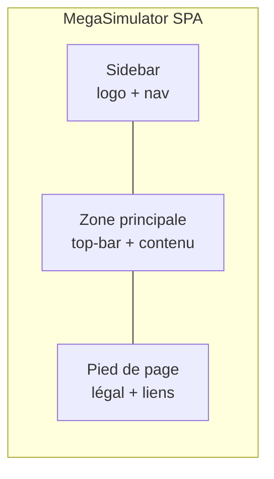

**MegaSimulator — Brand & UI guidelines**

_Dernière mise à jour : 2026-04-02_

---

## 1. Identité visuelle

### Monogramme & logo

- **Fichier** : `src/Frontend/public/brand-mark.png` (PNG **transparent**, monogramme **m** + **$**, dégradé violet → magenta).
- **Composant React** : `src/Frontend/src/components/Logo.jsx` — prop `size` = **hauteur** en px, largeur **auto** (logo horizontal).
- **Favicon (résultats Google)** : fichiers **carrés** dans `public/` — `favicon-48.png` (48×48), `favicon.ico`, `apple-touch-icon.png` (192×192), générés à partir du logo pour respecter les [consignes Google](https://developers.google.com/search/docs/appearance/favicon-in-search) (multiples de 48 px, **carré**). Référencés dans `index.html` (`?v=` pour cache-bust).
- **OG / Twitter / partage** : `SeoHead.jsx` peut continuer d’utiliser `brand-mark.png` (format large acceptable pour les aperçus sociaux).
- **Ne pas** forcer un fond blanc derrière le mark ; **ne pas** appliquer de `border-radius` qui rogne le PNG (`styles.css` : `.logo-mark` sans arrondi).
- **Tailles d’usage** : barre latérale simulateurs ~46px de haut ; panneau auth (login/signup) ~112px de haut, logo **centré au-dessus** du titre (voir `login.css` `.auth-brand-intro`).

### Palette (thème clair unique)

L’app est en **clair uniquement** (plus de thème sombre). Les tokens vivent dans `src/Frontend/src/styles.css` (`:root`).

| Rôle | Token | Valeur indicatives |
|------|--------|-------------------|
| Violet marque | `--brand-violet` | `#6d28d9` |
| Magenta / fuchsia accent | `--accent`, `--brand-fuchsia` | `#c026d3` |
| Pourpres | `--brand-purple`, `--brand-magenta` | `#5b21b6`, `#db2777` |
| Dégradé CTA / onglets actifs | `--gradient-brand` | violet → magenta (135deg) |
| Texte | `--text` | `#1e1b4b` |
| Secondaire | `--muted` | indigo ~52 % |
| Fond | `--bg`, `--bg2` | lavande très clair `#faf5ff` / `#f3e8ff` |
| Carte | `--card`, `--card-el` | blanc / lavande |
| Bordure | `--border` | violet faible opacité |
| Succès / warning / danger | `--success`, `--warning`, `--danger` | verts / ambre / rouge (inchangés sémantique) |
| Indigo UI (liens secondaires) | `--indigo` | alias `--brand-violet` |

**À faire** : préférer **toujours** les variables CSS — éviter les hex en dur dans JSX sauf constantes métier déjà présentes.

### Typographie

- **UI** : **Plus Jakarta Sans** (chargée depuis `index.html`), repli `Inter`, `system-ui`, sans-serif.
- Titres forts : `font-weight` 800–900 ; corps ~15px ; labels champs ~600.

---

## 2. Système de design (composants)

Référence code : `styles.css`, `login.css`.

| Zone | Notes |
|------|--------|
| Rayons | `--radius` 16px cartes, `--radius-sm` 11px, `--radius-input` 12px champs |
| Bouton primaire | `.btn-primary-custom` — dégradé marque, ombre légère |
| Bouton secondaire | `.btn-ghost` |
| Formulaires | `.field-input`, `.field-select` — `--input-min-height: 44px`, `--focus-ring` magenta/violet |
| Shell | `.sidebar` 230px, `.top-bar`, `.main-content`, `.page-body`, footer une ligne |
| Cartes vides / gate | `.page-panel`, `.page-panel-card`, `.sim-result-empty` (aligné simulateurs) |

---

## 3. UX — formulaires & accessibilité

- **Cibles tactiles** : hauteur minimale des champs 44px (`--input-min-height`).
- **Focus clavier** : anneau visible cohérent (`--focus-ring`) ; `focus-visible` sur liens / boutons nav.
- **Contraste** : viser WCAG AA sur texte / fond.
- **Formulaires auth** : labels visibles, `autoComplete` correct, erreurs `role="alert"` où pertinent.

---

## 4. Schéma — enveloppe UI (shell)



---

## 5. Fichiers clés

```
src/Frontend/public/brand-mark.png
src/Frontend/src/components/Logo.jsx
src/Frontend/src/styles.css
src/Frontend/src/login.css
src/Frontend/src/App.jsx
src/Frontend/src/Home.jsx
src/Frontend/index.html
```

---

## 6. À éviter

- Réintroduire un thème sombre sans revue complète des tokens.
- Logo sur fond blanc opaque si le PNG est déjà transparent.
- Mélanger une ancienne palette « teal » avec la marque violet / magenta.

