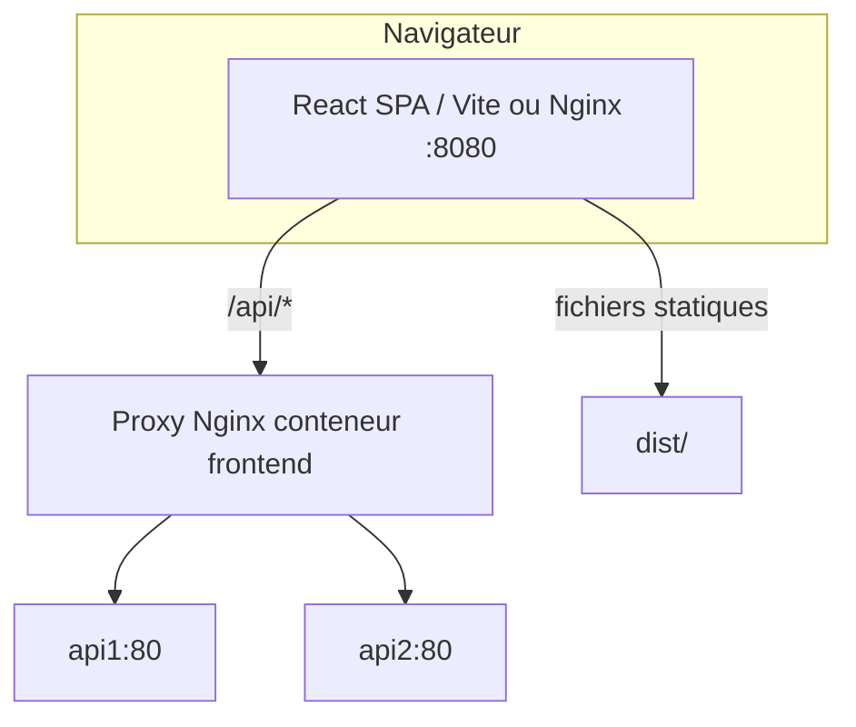

# Frontend — Guidelines techniques

_Dernière mise à jour : 2026-04-03 — payload paie (avantages structurés), retraite trimestres 1964+_

---

## 1. Stack technique

| Élément | Version | Notes |
|---|---|---|
| React | 18.2 | Hooks uniquement, pas de class components |
| Vite | 5.4 | Dev server port 5173, proxy `/api` → `http://localhost:5000` |
| Bootstrap CSS | 5.3.2 (CDN) | CSS uniquement — pas de JS Bootstrap |
| Bootstrap Icons | 1.10.5 (CDN) | Utilisé pour quelques icônes statiques |
| Plus Jakarta Sans | `index.html` (Google Fonts) | Police principale UI ; repli Inter / system-ui |

---

## 2. Architecture des fichiers

```
src/Frontend/
  index.html                  ← Root HTML (lang=fr, meta description par défaut)
  vite.config.js              ← Proxy /api ; post-build sitemap.xml + robots.txt (VITE_PUBLIC_SITE_URL)
  vercel.json                 ← SPA fallback → index.html (hébergement Vercel)
  public/_redirects           ← SPA fallback Netlify
  src/
    main.jsx                  ← HelmetProvider + BrowserRouter
    App.jsx                   ← Routes (redirections SEO alias) + AppShell (auth overlay)
    Home.jsx                  ← Shell synchronisé sur useLocation ; lien logo → paie (`PATH.payroll`)
    seo/
      paths.js                ← Chemins canoniques FR
      SeoHead.jsx             ← Helmet par onglet
      SeoIntro.jsx            ← Paragraphe visible pédagogique / SEO léger
    PayrollSimulator.jsx      ← Simulateur de paie (composant principal)
    RetirementSimulator.jsx   ← Simulateur retraite (✅ implémenté — voir section 7)
    LoanSimulator.jsx         ← Prêts immo (PTZ, TVA réduite, PAL) + auto + conso
    SimulationHistory.jsx     ← Historique (GET /api/simulation/mine) — affiche **10** entrées max / texte limite
    legal/                    ← Mentions légales, politique confidentialité, bandeau cookies
    Login.jsx                 ← Page auth split-screen + bouton Google GSI
    Signup.jsx                ← Page inscription
    Account.jsx               ← Page profil utilisateur
    Contact.jsx               ← Contact → POST /api/contact (pas de mailto de secours)
    components/
      Logo.jsx                ← Composant logo centralisé
    styles.css                ← Design system global (tokens CSS + composants)
    login.css                 ← Styles spécifiques à la page auth
```

### 2.1 SEO — chemins et alias

Chemins **canoniques** (partage et balises `canonical`) — alignés sur `src/seo/paths.js` :

| Chemin | Contenu |
|--------|---------|
| `/simulateur-paie-brut-net` | Paie (brut/net, portage, etc.) |
| `/simulation-retraite` | Retraite |
| `/simulation-credit-pret` | Prêts |
| `/simulation-epargne` | Épargne (placeholder) |
| `/contact` | Contact |
| `/historique` | Historique (**invité** : carte « non connecté » ; **connecté** : liste) |
| `/mon-compte` | Compte (**même gate** invité que Historique) |
| `/mentions-legales` | Mentions légales |
| `/politique-de-confidentialite` | Politique de confidentialité (RGPD) |

**Historique** : côté API, chaque utilisateur authentifié n’a que les **10 simulations les plus récentes** en base (`SimulationRepository.MaxSimulationsPerUser`) ; l’UI affiche le compteur « n / 10 » et une phrase d’information.

**Redirections 301 (client)** vers la canonique : `/` → paie ; `/portage-salarial`, `/salaire-brut-net`, `/simulation-portage-salarial`, `/simulateur-salaire` → paie ; `/pret-immobilier`, `/credit-immobilier`, `/simulateur-pret` → prêts ; `/simulation-retraite-bilan` → retraite.

**Build prod** : définir `VITE_PUBLIC_SITE_URL` (origine publique, sans `/` final) pour générer `dist/sitemap.xml` et `dist/robots.txt`. Défaut : `http://localhost:5173`.

**Limite** : application React CSR — l’indexation s’appuie sur l’exécution JS par Google et sur titres/métas/canonical ; pour du HTML pré-rendu serveur (SSR), il faudrait une évolution d’infra (hors scope actuel).

### 2.2 Schéma — routage & API (dev / prod)



En **local**, Vite (`5173`) proxy `/api` → `localhost:5000` (`vite.config.js`). En **prod**, le **Nginx du conteneur frontend** (`src/Frontend/nginx.conf`) fait `proxy_pass` vers `api1` / `api2` ; le Nginx **hôte** (`deploy/megasimulateur.nginx.conf`) envoie tout le trafic vers `:8080`.

---

## 3. Design system

Se référer à `docs/brand-guidelines.md` pour la palette, tokens et règles visuelles complètes.

**Principe clé :** toutes les couleurs passent par les variables CSS (`--accent`, `--card`, etc.) — jamais de hex hardcodé dans les composants JSX.

---

## 4. App.jsx — État global et auth

- **Pas d’écran login obligatoire** : `Home` est toujours rendu ; les invités utilisent simulateurs, **Contact**, **Historique** et **Mon compte** (derniers = cartes « non connecté »).
- États : `token` (JWT **normalisé** : trim + chaîne vide → `null`, via `readStoredToken()` / `onLoginSuccess`), `authScreen` (`null` \| `'login'` \| `'signup'`), `lang`.
- Persistance : `localStorage` — `msim_token`, `msim_lang` (**pas** de thème sombre ; clé `msim_dark` retirée).
- Clic « Se connecter » → overlay plein écran (`.auth-fullscreen-overlay`) avec `Login` ou `Signup` ; « Retour aux simulations » (`onDismiss`) ferme l’overlay.
- Query `?token=` : JWT trim + stockage + fermeture overlay.
- `controls-bar` (coin fixe haut-droite) : **sélecteur de langue FR/EN uniquement**.

### 4.1 Google Sign-In (GSI) — `Login.jsx`

- Client ID : `import.meta.env.VITE_GOOGLE_CLIENT_ID` (voir `.env.example`) ou valeur de repli dans le code ; **trim** ; validation suffixe `.apps.googleusercontent.com`.
- `google.accounts.id.initialize` : `use_fedcm_for_button: false` pour limiter les erreurs `401 invalid_client` / flux FedCM si la console Google n’est pas alignée.
- **Texte gris sous le bouton Google** : aide utilisateur / dev — rappelle d’ajouter **l’origine JavaScript exacte** (`window.location.origin`, plus `127.0.0.1:5173` si besoin) dans Google Cloud Console. Ce n’est **pas** un message d’erreur émis par l’API MegaSimulator ; c’est une consigne de configuration **Google**.
- Redémarrer Vite après toute modification de `.env.local`.

### 4.2 Styles boutons (pages formulaire)

- Préférer **`btn-primary-custom`** et **`btn-ghost`** (`styles.css`) pour les actions principales / secondaires — aligné avec `PayrollSimulator`.
- Pages **Account**, **Contact**, **RetirementSimulator** : panneaux **`.page-panel`** / **`.page-panel-card`** + champs **`.field-input`** / **`.field-label`**.

---

## 5. Home.jsx — Shell principal

- Sidebar : **Simulations** (Paie, Retraite, Prêts, Épargne — **sans** badge « Bientôt » sur ces onglets).
- **Espace personnel** : **Historique**, **Mon compte**, **Contact** — **toujours visibles** ; en bas, bloc utilisateur ou bouton **Se connecter**.
- **Invité sur Historique / Mon compte** : même UX — carte `.page-panel` / `.page-panel-card`, texte **« Vous n’êtes pas connecté. »**, boutons **Se connecter** / **Créer un compte** (pas de redirection forcée vers la paie).
- `onRequestLogin` / `onRequestSignup` depuis `App.jsx` pour ouvrir l’overlay auth.
- **Footer** : une ligne (©, Mentions légales, Confidentialité, Contact) ; layout `main-content` / `page-body` pour pied de page en bas sur pages courtes.
- Hamburger & drawer sidebar ; `tab-bar` visible pour les onglets Paie / Retraite / Prêts / Épargne uniquement.

---

## 6. PayrollSimulator.jsx — Composant principal

### 6.1 Structure

Layout en deux panneaux (`sim-shell` : grille `1fr 400px`) :
- **Panneau gauche** : formulaire de saisie (`.sim-form-card`)
- **Panneau droit** : résultats (`.sim-result-card`, sticky)

### 6.2 Statuts disponibles (StatusPicker)

4 cartes visuelles dans une grille 2×2 :

| Valeur | Label FR | Détails |
|---|---|---|
| `non-cadre` | Non-cadre | Salarié régime général |
| `cadre` | Cadre | Statut cadre AGIRC |
| `freelance` | Freelance | Sous-formulaire : type structure (ME/EURL/SASU) + CA annuel HT |
| `portage` | Portage salarial | Sous-formulaire : CA mensuel HT + slider frais portage (3–20%) |

### 6.3 Calcul du brut effectif (frontend)

Le frontend calcule un `brutAnnuel` équivalent avant d'appeler l'API :

```js
// Freelance ME (micro-social services 22%)
brutAnn = caAnnuel * (1 - 0.22)

// Freelance EURL (TNS ~40% charges)
brutAnn = caAnnuel * 0.60

// Freelance SASU (charges président ~45%)
brutAnn = caAnnuel * 0.55

// Portage salarial
// Enveloppe après frais = CA × (1 − frais%) ; brut tel que brut × 1,45 ≈ coût employeur (cf. PayrollService)
// → coût employeur ne dépasse pas l’enveloppe (évite masse > CA HT)
brutMensuel = caMensuel * (1 - portagePercent/100) / 1.45
brutAnn = brutMensuel * 12
```

### 6.4 Mode fiscal (FiscalToggle)

Toggle exclusif **Foyer fiscal** ↔ **Retenue à la source** :
- **Foyer fiscal** : sélecteur de parts (chips 1/1.5/2/2.5/3/3.5/4/5) + auto-suggestion basée sur situation familiale + enfants
- **Retenue à la source** : slider 0–55% + badge de suggestion auto (barème PAS 2026) cliquable

**Barème PAS 2026 (suggestion auto) :**

| Net annuel estimé | Taux suggéré |
|---|---|
| ≤ 14 490 € | 0% |
| ≤ 21 917 € | 2% |
| ≤ 31 425 € | 7.5% |
| ≤ 58 360 € | 14% |
| ≤ 80 669 € | 22% |
| ≤ 177 106 € | 30% |
| > 177 106 € | 41% |

### 6.5 Payload API

```json
POST /api/payroll/simulate
{
  "Brut": <brutAnn/12>,
  "BrutAnnuel": <brutAnn>,
  "Statut": "non-cadre|cadre",
  "Parts": <number>,
  "RevenusAnnexes": <number>,
  "Primes": <number>,
  "TransportMensuel": <number>,
  "TeletravailMensuel": <number>,
  "TicketRestoMensuel": <number>,
  "TicketRestoEmployeurPct": <0-100>,
  "MutuelleNetDeduction": <number>,
  "RetenuePct": <0-55>,
  "FreelanceType": "me|eurl|sasu|null",
  "PortagePercent": <number|null>,
  "CaAnnuel": <number|null>,
  "CaMensuel": <number|null>
}
```

Salarié : le front envoie `RevenusAnnexes` et `Primes` à **0** et renseigne les champs transports / titres-restaurant / télétravail / mutuelle. Freelance : `TransportMensuel`… à **0**, annexes/primes utilisés comme avant.

### 6.6 Résultats affichés (KPI cards)

- Net mensuel (vert) / Net annuel (accent marque) / Cotisations sociales (orange) / Coût employeur (indigo/violet)
- Carte retenue à la source (rouge) si mode retenue et taux > 0
- Carte frais portage (orange) si statut portage
- Barre de répartition : Net / Cotisations / Charges patronales

---

## 7. RetirementSimulator.jsx — implémenté ✅

> **Statut : IMPLÉMENTÉ** (`src/Frontend/src/RetirementSimulator.jsx`). Même pattern que `PayrollSimulator.jsx`.

### 7.1 Structure

Layout `sim-shell` (grille `1fr 400px`) identique au simulateur de paie :
- **Panneau gauche** : formulaire de saisie (`.sim-form-card`)
- **Panneau droit** : résultats (`.sim-result-card`, sticky)

### 7.2 Formulaire de saisie

| Champ | Type | Défaut | Notes |
|---|---|---|---|
| Année de naissance | number input | — | Pour déduire trimestres requis et âge légal |
| Âge actuel | calculé | auto | Déduit de l'année de naissance |
| Âge de départ souhaité | slider 60–70 | 64 | Affiche alerte si < âge légal |
| Salaire annuel moyen brut (SAM) | EuroInput | — | Moyenne 25 meilleures années |
| Trimestres validés | slider 0–200 | — | Nombre de trimestres acquis |
| Trimestres requis | number input | selon année | Pré-rempli (ex. 1963–1964→170, 1965→171, 1966+→172), aligné backend — modifiable (1965 T1 : 170 en droit réel) |
| Points Agirc-Arrco | number input | — | Points complémentaires accumulés |
| Régime | selector chips | général | général / fonctionnaire / libéral / artisan |
| Revenus annuels actuels | EuroInput | — | Pour calcul taux de remplacement |

### 7.3 Payload API

```json
POST /api/retirement/simulate
Authorization: Bearer <token>
Content-Type: application/json
{
  "AnneeNaissance": 1963,
  "AgeDepart": 64,
  "SalaireAnnuelMoyen": 40000,
  "TrimestresValides": 160,
  "TrimestresRequis": 170,
  "PointsComplementaires": 8000,
  "Regime": "general",
  "RevenusAnnuelsActuels": 52000
}
```

### 7.4 Résultats affichés (KPI cards)

| KPI | Couleur | Valeur |
|---|---|---|
| Pension nette mensuelle | vert `--success` | Principal |
| Pension brute annuelle | accent `--accent` | |
| Taux de remplacement | indigo `--indigo` | pension / revenu actuel |
| Pension base CNAV | muted | Détail |
| Pension complémentaire | muted | Détail |
| Décote appliquée | rouge `--danger` | Si trimestres manquants |
| Surcote appliquée | vert | Si trimestres en plus |
| Trimestres manquants | orange | Si < requis |

### 7.5 Wiring dans Home.jsx

Remplacer le bloc `tab === 'retirement'` :
```jsx
import RetirementSimulator from './RetirementSimulator'
// ...
{tab === 'retirement' && <RetirementSimulator lang={lang} onLangChange={onLangChange} />}
```
Supprimer le badge `Bientôt` sur l'item sidebar Retraite.

### 7.6 Traductions requises (T object)

```js
const T = {
  fr: {
    title: 'Simulateur de retraite',
    anneeNaissance: 'Année de naissance',
    ageDepart: 'Âge de départ souhaité',
    sam: 'Salaire annuel moyen (SAM)',
    trimValides: 'Trimestres validés',
    trimRequis: 'Trimestres requis',
    points: 'Points Agirc-Arrco',
    regime: 'Régime',
    revenusActuels: 'Revenus annuels actuels',
    simulate: 'Calculer',
    reset: 'Réinitialiser',
    pensionNetteMensuelle: 'Pension nette mensuelle',
    pensionBruteAnnuelle: 'Pension brute annuelle',
    tauxRemplacement: 'Taux de remplacement',
    baseLabel: 'Retraite de base (CNAV)',
    complLabel: 'Complémentaire (Agirc-Arrco)',
    decote: 'Décote appliquée',
    surcote: 'Surcote appliquée',
    trimManquants: 'Trimestres manquants',
  },
  en: { /* ... */ }
}
```

---

## 8. SimulationHistory.jsx

- **`GET /api/simulation/mine`** — `[Authorize]` ; liste **10** entrées max par utilisateur (voir backend `SimulationRepository`).
- **Sans JWT valide** (ou 401/403 après chargement) : **même écran que Mon compte invité** — titre page, **« Vous n’êtes pas connecté. »**, **Se connecter** / **Créer un compte** (`onRequestLogin` / `onRequestSignup`).
- **Connecté** : cartes par type (paie, retraite, prêt, épargne, …), suppression `DELETE /api/simulation/{id}`.
- **Classes CSS** : `.history-card`, `.history-badge--*`, `.history-figure`, `.history-delete-btn`.

---

## 9. Login.jsx / Signup.jsx — auth

- Layout **clair** split-screen : panneau marque (gauche) + formulaire (droite) ; styles **`login.css`** (tokens alignés `styles.css`).
- Logo : composant **`Logo.jsx`** (`brand-mark.png`), **grand** et **centré** au-dessus du titre sur le panneau marque ; pas de doublon logo dans l’en-tête du formulaire.
- Google GSI : inchangé (voir § 4.1).

---

## 10. Sécurité / Auth

- Token JWT stocké dans `localStorage` (clé `msim_token`) — **temporaire, acceptable pour MVP**
- **À migrer** vers cookie `HttpOnly; Secure; SameSite=Strict` côté serveur (voir `AuthController.cs`)
- Toujours inclure `Authorization: Bearer <token>` dans les appels simulate (payroll, retraite, …) lorsque l’utilisateur est connecté
- Ne jamais exposer les erreurs techniques brutes à l'utilisateur
- **Google OAuth GSI** : `index.html` charge `accounts.google.com/gsi/client` async ; `Login.jsx` initialise le bouton officiel Google dans un `useEffect` avec `google.accounts.id.initialize` ; l'ID token est soumis à `POST /api/auth/google/token` ; **aucun redirect**, aucun client secret needed
- Important : ajouter `http://localhost:5173` (et si besoin `http://127.0.0.1:5173`) dans **Authorized JavaScript origins** de la Google Cloud Console pour le client Web.

---

## 11. Internationalisation

- Objet de traductions `T` en haut de chaque composant majeur (fr/en)
- La langue est transmise via la prop `lang` depuis `App.jsx`
- Fichiers JSX doivent être encodés **UTF-8 sans BOM**
- ⚠️ Ne jamais utiliser `Set-Content` PowerShell sans `-Encoding UTF8NoBOM` — risque de double-encodage des caractères accentués

---

## 12. Responsive / Mobile

- **≤ 768px** : hamburger visible, sidebar en drawer slide-over (`.sidebar-overlay`), `sidebar.sidebar-open`
- **≤ 1024px** : `sim-shell` passe en 1 colonne (`grid-template-columns: 1fr`), `.sim-result-card` non sticky
- **≤ 480px** : labels des tabs masqués (icônes seules)
- Toujours tester avec Chrome DevTools en mode mobile après chaque modification

---

## 13. Checklist avant commit

- [ ] `npm run build` dans `src/Frontend/` sans erreur
- [ ] Pas de caractères corrompus (`Ã`, `â€`) dans les fichiers JSX/CSS
- [ ] `Authorization: Bearer` sur les appels API authentifiés
- [ ] Responsive testé (mobile ≤ 768px, tablette ≤ 1024px)
- [ ] Thème **clair** cohérent (tokens `styles.css` / `login.css`)
- [ ] Proxy `/api` (dev) ou Nginx conteneur (prod) vérifié si l’historique ou l’auth échouent
- [ ] `EuroInput` et composants stables définis au **niveau module** (pas dans le corps du composant)