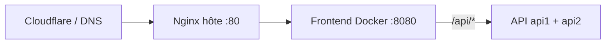

# Déploiement & domaine — megasimulateur.org

**Référence détaillée (procédures, tunnel DB, variables, pièges) :** [`deploy/DEPLOY.md`](../../deploy/DEPLOY.md)

---

## Checklist rapide

- [x] VPS + Docker Compose (`docker-compose.deploy.yml`) : Postgres, Redis, api1/api2, frontend sur `127.0.0.1:8080`.
- [x] Nginx hôte : `proxy_pass` → `127.0.0.1:8080` (ex. `deploy/megasimulateur.nginx.conf`).
- [x] Cloudflare : DNS vers le VPS ; SSL **Flexible** possible tant que l’origine est HTTP :80.
- [x] `.env` sur le serveur : `JWT__KEY`, `FRONTEND__URL`, `GOOGLE__*`, `VITE_PUBLIC_SITE_URL`, `VITE_GOOGLE_CLIENT_ID` au build frontend.
- [x] Google Cloud : origines JS + redirect URI production.
- [x] Migrations SQL embarquées dans l’image API (dossier `Infrastructure/Migrations`).
- [ ] Rotation mot de passe Postgres et secrets si exposition réseau évolue.

## Rappels produit / légal

- Historique utilisateur : **10** simulations max par compte.
- **UX** : app **clair** ; identité **violet → magenta** ; `brand-mark.png` transparent ; invité sur **Historique** / **Mon compte** = même gate « non connecté ».
- Mentions / confidentialité : **`/mentions-legales`**, **`/politique-de-confidentialite`** — contact **uniquement** via la page Contact (pas d’e-mail public `m-simulator.com`).
- Compte technique **admin** : e-mail en base **`admin@megasimulateur.org`** (pas une boîte opérationnelle imposée).

### Schéma prod (trafic)

---

_Document vivant — détail opérationnel dans `deploy/DEPLOY.md`._
